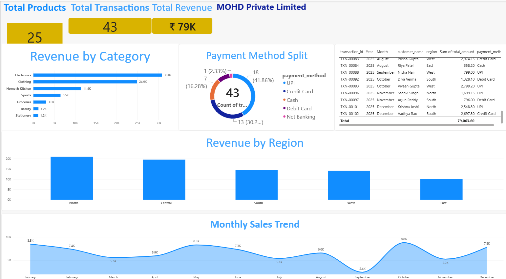

# Power BI Sales Dashboard

My first Power BI dashboard. Built it while learning the basics — connecting data, making visuals, and putting together a simple layout.

## What's in it

A single-page dashboard with 8 visuals on a sales dataset (products + sales transactions):

- **3 KPI Cards** — Total Products (25), Total Transactions (43), Total Revenue (₹79K)
- **Bar Chart** — Revenue by Category
- **Donut Chart** — Payment Method Split
- **Column Chart** — Revenue by Region
- **Line Chart** — Monthly Sales Trend
- **Table** — Transaction details with customer and region info

## Data

Two tables:

**products** (25 rows)
- product_id, product_name, category, subcategory, cost_price, unit_price, supplier, launch_year

**sales_transactions** (43 rows)
- transaction_id, order_date, customer_id, customer_name, region, city, product_id, quantity, unit_price, discount_pct, total_amount, payment_method

## What I learned building this

- How to connect CSV files to Power BI Desktop
- Difference between Card and Multi-row Card (took me a while to figure out)
- How to drag fields into X-axis and Y-axis
- Date hierarchy in line charts (Year > Quarter > Month)
- Formatting basics — titles, colors, number formats

## A few things I noticed in the data

- Electronics brings in the most revenue by category
- North region leads, East is lowest
- UPI is the most used payment method, which surprised me
- Sales peak around October, dip in September

## Dashboard Preview

## Files
├── Phase1_Sales_Dashboard.pbix
├── README.md
└── screenshots/
└── dashboard.png

## How to open

1. Install Power BI Desktop (free, Windows only)
2. Open `Phase1_Sales_Dashboard.pbix`
3. All visuals load from the embedded data

## What's next

This is Phase 1 — just the basics. Next up:

- Power Query for data cleaning
- Data modeling with a proper star schema
- DAX measures for calculated insights
- Time intelligence for YoY and MoM comparisons

## About me

Mohd. Yusuf — learning Power BI, building projects, looking for my first data analyst role.

GitHub: [@codewithmorcous](https://github.com/codewithmorcous)

---

*Built September 2026. Dataset is fictional, made for practice.*
